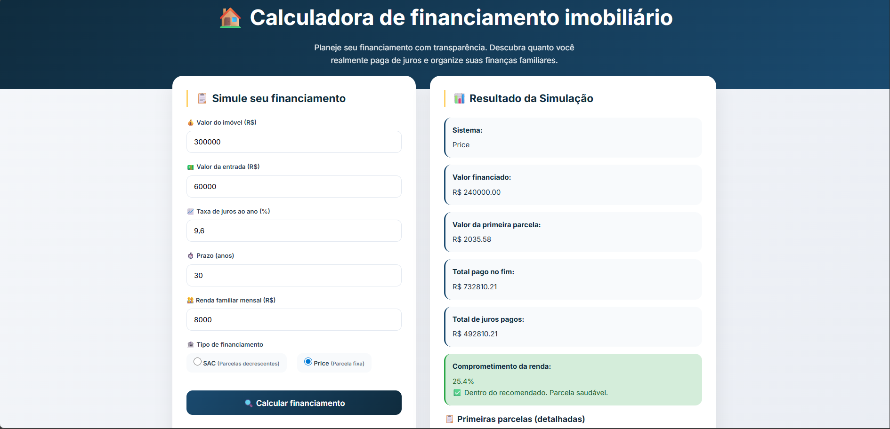

# 🏠 Calculadora de Financiamento Imobiliário

[](https://github.com/seuusuario/financiamento-calculadora/actions/workflows/ci.yml)
[](https://github.com/seuusuario/financiamento-calculadora/releases/tag/v1.0.0)
[](LICENSE)

## 📌 Índice

- [Sobre o Projeto](#sobre-o-projeto)
- [Problema Real](#problema-real)
- [Proposta da Solução](#proposta-da-solução)
- [Público-alvo](#público-alvo)
- [Funcionalidades](#funcionalidades)
- [Tecnologias Utilizadas](#tecnologias-utilizadas)
- [Estrutura do Projeto](#estrutura-do-projeto)
- [Instalação](#instalação)
- [Execução](#execução)
- [Testes](#testes)
- [Linting](#linting)
- [Versionamento](#versionamento)
- [Autor](#autor)
- [Link do Repositório](#link-do-repositório)

---

## Sobre o Projeto

A calculadora de financiamento imobiliário é uma aplicação web que calcula financiamentos imobiliários nos sistemas **SAC** (Sistema de Amortização Constante) e **Price** (Tabela Price). A ferramenta permite visualizar, de forma clara e transparente, o valor das parcelas, a amortização real da dívida, os juros pagos e o impacto no orçamento familiar.



---

## Problema Real

### A falta de transparência nos financiamentos imobiliários

Milhões de brasileiros sonham com a casa própria, mas poucos entendem como funciona um financiamento. As principais dores identificadas são:

| Problema | Impacto |
|----------|---------|
| **Falta de clareza sobre juros** | O comprador não sabe quanto do valor pago realmente reduz a dívida e quanto é "jogado fora" em juros. |
| **Comprometimento excessivo da renda** | Muitas pessoas assumem parcelas que comprometem mais de 30% da renda familiar, gerando endividamento. |
| **Dificuldade em comparar sistemas** | A maioria não sabe a diferença entre SAC e Price, nem qual é mais vantajoso para seu perfil. |
| **Ausência de planejamento** | Sem uma visualização clara do futuro, o comprador pode tomar decisões financeiras ruins. |

### Dados relevantes

- 📊 **70%** dos financiamentos imobiliários no Brasil são feitos sem simulação prévia adequada (Fonte: ABECIP)
- 💰 Em um financiamento de **R$ 300.000** em 30 anos, os juros podem ultrapassar **R$ 350.000** - mais que o valor do imóvel
- ⚠️ **40%** das famílias brasileiras estão endividadas acima do recomendado (30% da renda)

---

## Proposta da Solução

A **Calculadora** resolve essas dores oferecendo:

✅ **Transparência total** - Mostra, parcela a parcela, quanto é amortização e quanto são juros.

✅ **Planejamento familiar** - Calcula o percentual da renda comprometido e gera alertas coloridos.

✅ **Comparação entre sistemas** - Permite alternar entre SAC e Price no mesmo cenário.

✅ **Visualização clara** - Interface amigável com cards informativos e tabela detalhada.

✅ **Zero custo** - Aplicação 100% gratuita, rodando no navegador.

---

## Público-alvo

| Grupo | Como se beneficia |
|-------|-------------------|
| **Compradores de primeira viagem** | Entendem o impacto real do financiamento antes de assinar o contrato. |
| **Famílias de classe média** | Planejam o orçamento familiar com base em dados reais. |
| **Corretores de imóveis** | Oferecem simulações transparentes para seus clientes. |
| **Estudantes de finanças** | Aprendem na prática como funcionam os sistemas SAC e Price. |
| **Educadores financeiros** | Utilizam a ferramenta em aulas e workshops. |

---

## Funcionalidades

### ✅ Funcionalidades Implementadas (v1.0.0)

| # | Funcionalidade | Descrição |
|---|----------------|-----------|
| 1 | **Cálculo SAC** | Calcula parcela decrescente com amortização constante. |
| 2 | **Cálculo Price** | Calcula parcela fixa durante todo o financiamento. |
| 3 | **Amortização detalhada** | Mostra, parcela a parcela, o valor amortizado e os juros. |
| 4 | **Percentual da renda** | Calcula quanto da renda familiar será comprometido. |
| 5 | **Alertas coloridos** | 🔴 Vermelho (>40%), 🟡 Amarelo (30-40%), 🟢 Verde (≤30%). |
| 6 | **Tabela de parcelas** | Exibe as primeiras 12 parcelas com saldo devedor. |
| 7 | **Totais do financiamento** | Mostra total pago e total de juros. |
| 8 | **Cards informativos** | Dados resumidos em destaque na página. |
| 9 | **Design responsivo** | Funciona em computadores, tablets e celulares. |
| 10 | **Testes automatizados** | Suite de testes para validar os cálculos. |


---

## Tecnologias Utilizadas

| Tecnologia | Versão | Finalidade |
|------------|--------|------------|
| **HTML5** | - | Estrutura da página |
| **CSS3** | - | Estilização e layout responsivo |
| **JavaScript** | ES2021 | Lógica da calculadora e interatividade |
| **ESLint** | 8.57.0 | Análise estática do código |
| **GitHub Actions** | - | Integração contínua (CI) |
| **Google Fonts** | - | Fontes Inter para melhor legibilidade |

### Dependências de Desenvolvimento

```json
{
  "devDependencies": {
    "eslint": "^8.57.0"
  }
}

